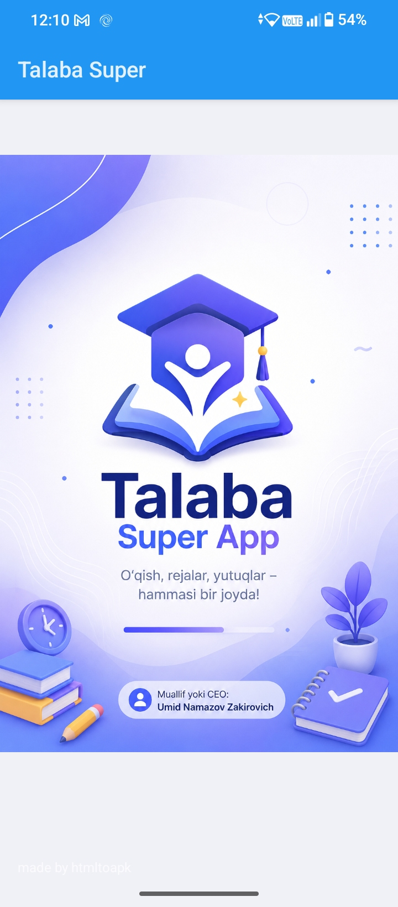
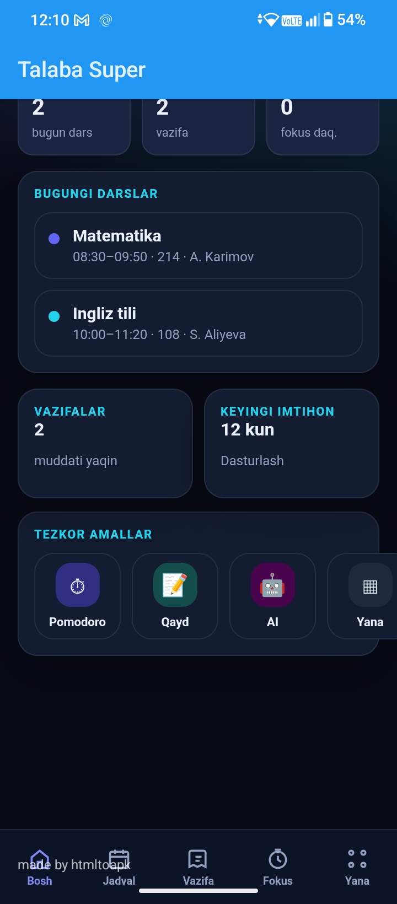
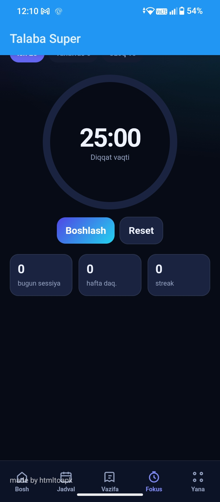
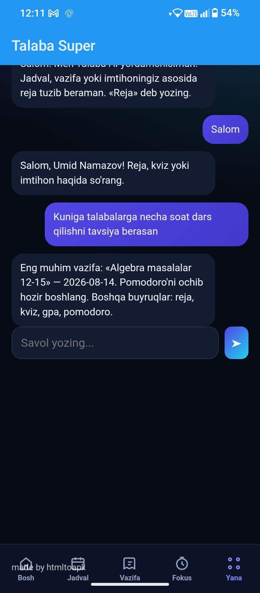
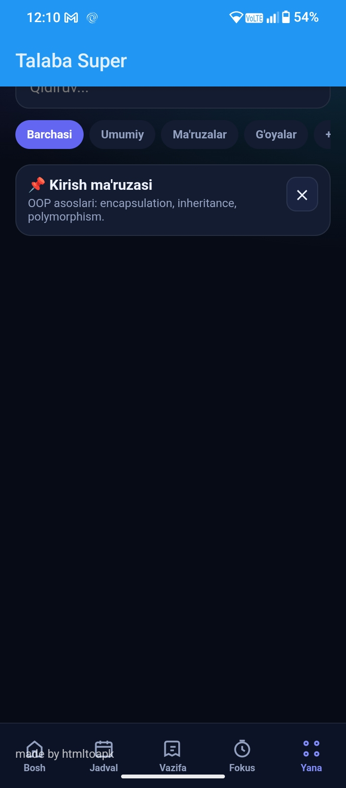
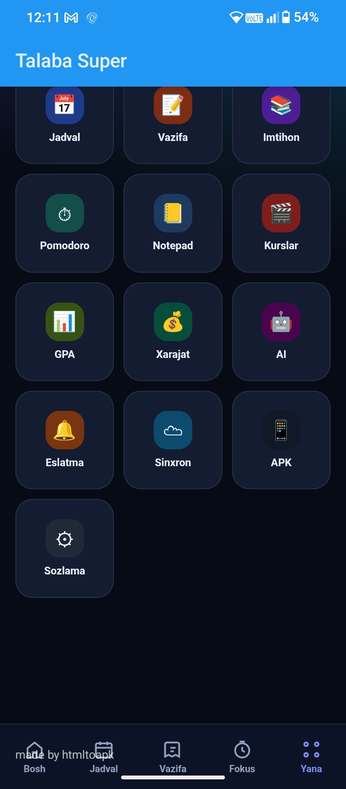

# 🎓 QueueLessapp

> Study, plan, and track your academic life — all in one place.

**QueueLessapp** is an all-in-one productivity web app built for students. It combines a class schedule, homework tracker, exam countdown, Pomodoro focus timer, notes, and an AI study assistant into a single lightweight, offline-friendly interface.

---

## 📱 Screenshots

<p align="center">
  
</p>

| Home / Dashboard | Focus Timer (Pomodoro) | AI Assistant |
|---|---|---|
|  |  |  |

| Notes / Board | Full Menu |
|---|---|
|  |  |

---

## ✨ Features

- **📊 Dashboard** — at-a-glance overview of today's classes, pending homework, days until the next exam, and quick-action shortcuts
- **📅 Schedule** — view daily class timetable with time, room, and instructor
- **📝 Homework Tracker** — track assignments and deadlines
- **📚 Exam Countdown** — live countdown to upcoming exams
- **⏳ Pomodoro Focus Timer** — 25-minute focus sessions with daily session count, weekly minutes, and streak tracking
- **📒 Notepad** — searchable notes, organized by category (lecture notes, ideas, general)
- **🎥 Courses** — track online course progress
- **📊 GPA Calculator** — calculate and monitor GPA
- **💰 Expense Tracker** — manage student budget and spending
- **🤖 AI Study Assistant** — chat-based assistant that generates study plans, answers questions about your schedule, tasks, and exams, and gives quick recommendations (e.g. "how many hours should I study per day")
- **🔔 Reminders** — notifications for upcoming deadlines
- **☁️ Sync** — sync data across devices
- **🌙 Dark Mode** — clean dark UI optimized for extended use
- **💾 Persistent Storage** — data is saved locally so nothing is lost on refresh

---

## 🛠️ Tech Stack

- HTML5
- CSS3
- JavaScript (Vanilla)
- LocalStorage for data persistence

---

## 🚀 Live Demo

🔗 [Try it here](https://umid-namazov.github.io/QueueLessapp/)


---

## 📦 Installation

```bash
git clone https://github.com/umid-namazov/QueueLessapp.git
cd QueueLessapp
```

Then simply open `index.html` in your browser — no build step or server required.

---

## 🗺️ Roadmap

- [ ] Push notifications for reminders
- [ ] Cloud sync via Firebase
- [ ] Exportable PDF study reports
- [ ] Multi-language support (Uzbek / English / Russian)
- [ ] PWA support (installable on mobile home screen)

---

## 👤 Author

**Umid Namazov**
AI Engineering Student, Samarqand, Uzbekistan
📧 bek193699@gmail.com

---

## 📄 License

This project is open source and available under the [MIT License](LICENSE).
