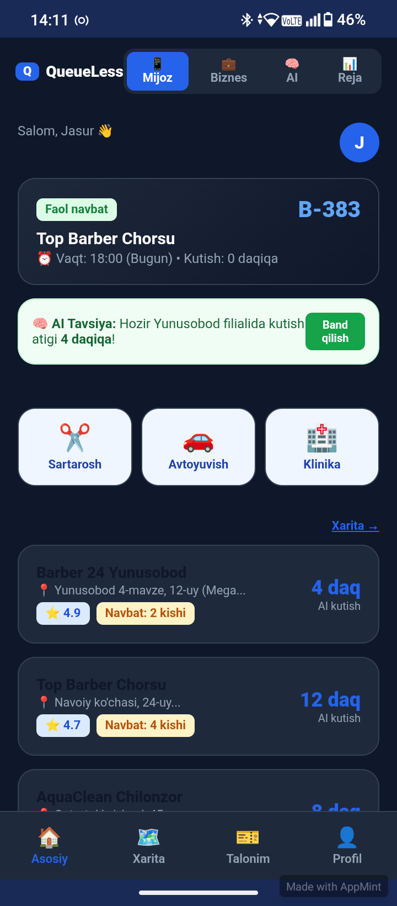
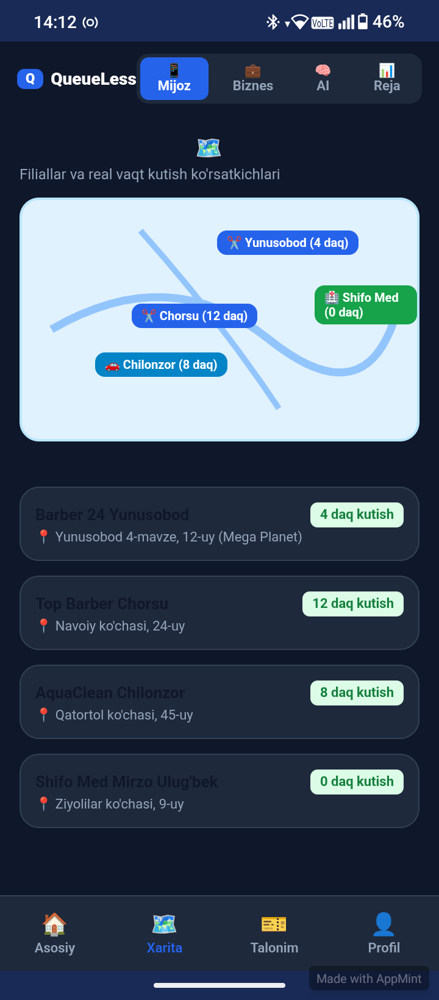
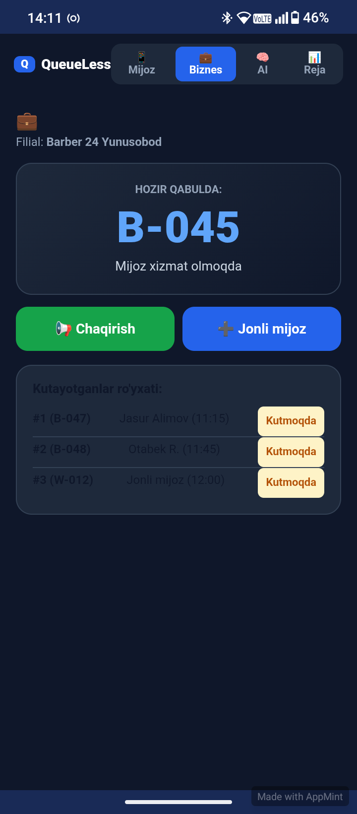
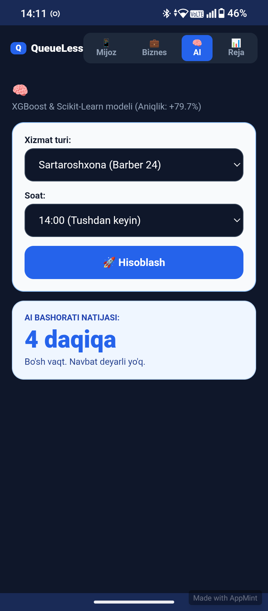

<div align="center">


# ⏳ QueueLess

### Smart Queues. Save Time.

**Navbatni oldindan band qiling, vaqtingizni tejang.**

[](https://umid-namazov.github.io/QueueLessapp/)


</div>

---

## 📖 Loyiha haqida

**QueueLess** — sartaroshxona, avtoyuvish va klinikalardagi jonli navbatni raqamli jadvalga aylantiruvchi veb-ilova. Mijoz uydan turib bo'sh vaqtni tanlaydi, QR-talon oladi va aynan o'z navbatiga keladi — eshik oldida kutib o'tirmaydi.

Ilova ichida **AI kutish vaqti bashorati** ishlaydi: xizmat turi va soatga qarab navbat qancha davom etishini oldindan hisoblab beradi va eng bo'sh filialni tavsiya qiladi.

> 🎓 Toshkent, O'zbekiston — 2026. 4 kishilik jamoaning hakaton va universitet loyihasi.

---

## 🎯 Muammo va yechim

| Muammo | QueueLess yechimi |
|---|---|
| Navbatda 30–60 daqiqa bekorga kutish | Oldindan vaqt band qilish (slot booking) |
| Qaysi filial bo'shligini bilmaslik | Xaritada real vaqt kutish ko'rsatkichlari |
| "Qachon kelay?" degan noaniqlik | AI bashorati — aniq daqiqa |
| Qog'oz talon, tartibsizlik | QR-kodli raqamli talon |
| Biznes uchun navbatni boshqarish qiyin | Biznes paneli — chaqirish, jonli mijoz qo'shish |

---

## 📱 Skrinshotlar

### Mijoz tomoni

| Asosiy sahifa | Vaqt tanlash | QR-talon |
|:---:|:---:|:---:|
|  |  |  |
| Faol navbat, AI tavsiya, xizmat toifalari va tavsiya etilgan filiallar | Band / Bo'sh / ⭐ Tavsiya qilingan vaqt oynalari | Tasdiqlangan talon, QR-kod va kutish vaqti |

### Xarita, biznes va AI

| Filiallar xaritasi | Biznes paneli | AI bashorati | Profil |
|:---:|:---:|:---:|:---:|
|  |  |  |  |
| Real vaqt kutish ko'rsatkichlari | Qabuldagi raqam, chaqirish, kutayotganlar | XGBoost modeli, aniq daqiqa | Dark mode, push, til sozlamalari |

---

## ✨ Imkoniyatlar

### 📱 Mijoz rejimi
- **Faol navbat kartasi** — talon raqami (B-383), filial nomi, vaqt va qolgan kutish daqiqasi
- **Xizmat toifalari** — ✂️ Sartarosh, 🚗 Avtoyuvish, 🏥 Klinika
- **Filiallar ro'yxati** — reyting (⭐ 4.9), navbatdagi kishilar soni va AI kutish vaqti
- **Vaqt tanlash** — Band / Bo'sh oynalar, AI ⭐ Tavsiya belgisi bilan eng qulay soat
- **QR-talon** — tasdiqlangan raqamli talon, joyiga borganda skanerlanadi
- **Talonni bekor qilish** va push-eslatmani sinash

### 🗺️ Xarita
- Filiallar joylashuvi va **real vaqt kutish ko'rsatkichlari** (4 daq / 12 daq / 0 daq)
- Manzil bilan to'liq ro'yxat: Yunusobod, Chorsu, Chilonzor, Mirzo Ulug'bek

### 💼 Biznes paneli
- **HOZIR QABULDA** — joriy xizmat ko'rsatilayotgan raqam katta ko'rinishda
- **📢 Chaqirish** — keyingi mijozni chaqirish
- **➕ Jonli mijoz** — ilovasiz kelgan mijozni navbatga qo'shish
- **Kutayotganlar ro'yxati** — tartib raqami, ism, vaqt va holat

### 🧠 AI moduli
- **XGBoost & Scikit-Learn** modeli asosida kutish vaqti bashorati (aniqlik: **+79.7%**)
- Xizmat turi va soatni tanlash → 🚀 Hisoblash → natija daqiqalarda
- Asosiy sahifada avtomatik tavsiya: *"Hozir Yunusobod filialida kutish atigi 4 daqiqa!"*

### 👤 Profil va sozlamalar
- Foydalanuvchi ma'lumotlari va telefon raqami
- 🌙 **Qorong'i rejim** (Dark mode)
- 🔔 **Push-eslatmalar** — navbatdan 30 va 10 daqiqa oldin
- 🌐 **Til** — O'zbekcha 🇺🇿

---

## 🛠️ Texnologiyalar

| Qatlam | Texnologiya |
|---|---|
| Frontend | HTML5, CSS3, JavaScript (Vanilla) |
| Ma'lumot saqlash | LocalStorage |
| AI modeli | XGBoost, Scikit-Learn |
| Hosting | GitHub Pages |
| Dizayn | Responsive, mobile-first, Dark mode |

---

## 🚀 Live Demo

🔗 **[https://umid-namazov.github.io/QueueLessapp/](https://umid-namazov.github.io/QueueLessapp/)**

Ro'yxatdan o'tish shart emas — havolani ochib, to'rtta rejimni (Mijoz / Biznes / AI / Reja) sinab ko'rishingiz mumkin.

---

## 📦 O'rnatish

```bash
git clone https://github.com/umid-namazov/QueueLessapp.git
cd QueueLessapp
```

So'ng `index.html` faylini brauzerda oching — build yoki server talab qilinmaydi.

---

## 📂 Fayllar tuzilishi

```
QueueLessapp/
├── index.html      # Asosiy sahifa va barcha ekranlar
├── style.css       # Uslublar, dark mode
├── script.js       # Navbat mantiqi, AI bashorati, LocalStorage
├── README.md
└── *.png           # Skrinshotlar
```

---

## 🗺️ Rejalar (Roadmap)

- [ ] Real push-bildirishnomalar (Firebase Cloud Messaging)
- [ ] Backend va real vaqt sinxronizatsiya
- [ ] Haqiqiy xarita integratsiyasi (Yandex / Google Maps)
- [ ] Telegram bot orqali navbat band qilish
- [ ] To'lov tizimi (Payme / Click)
- [ ] PWA — telefon ekraniga o'rnatiladigan versiya
- [ ] Ko'p tillilik: O'zbek / Rus / Ingliz
- [ ] Biznes uchun statistika va hisobotlar

---

## 👤 Muallif

**Umid Namazov Zakirovich**
AI Engineering talabasi · Samarqand, O'zbekiston
📧 bek193699@gmail.com
🔗 [github.com/umid-namazov](https://github.com/umid-namazov)

Loyiha **AETXON** jamoasi tomonidan ishlab chiqilgan.

---

## 📄 Litsenziya

Ushbu loyiha ochiq manbali va [MIT litsenziyasi](LICENSE) asosida tarqatiladi.

---

<div align="center">

**⏳ QueueLess — Navbatni jadvalga aylantiramiz.**

Loyiha yoqqan bo'lsa ⭐ qo'yishni unutmang!

</div>
